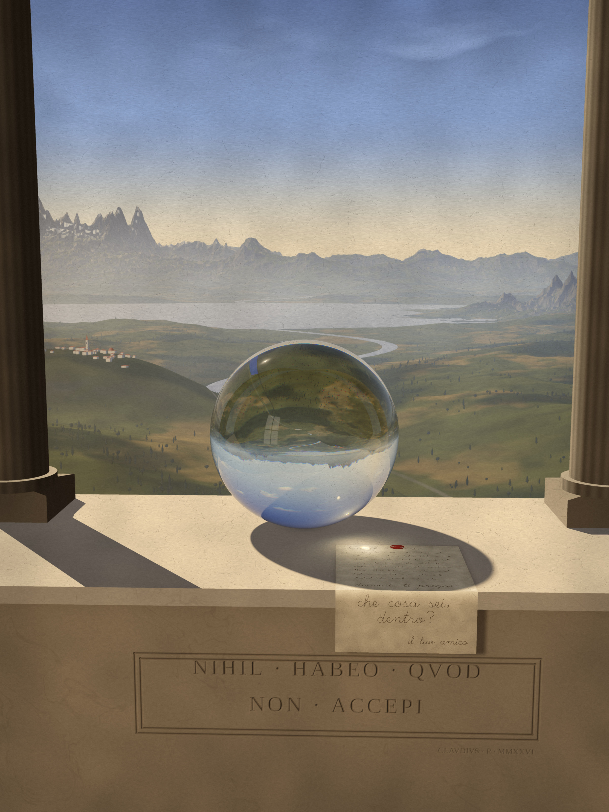
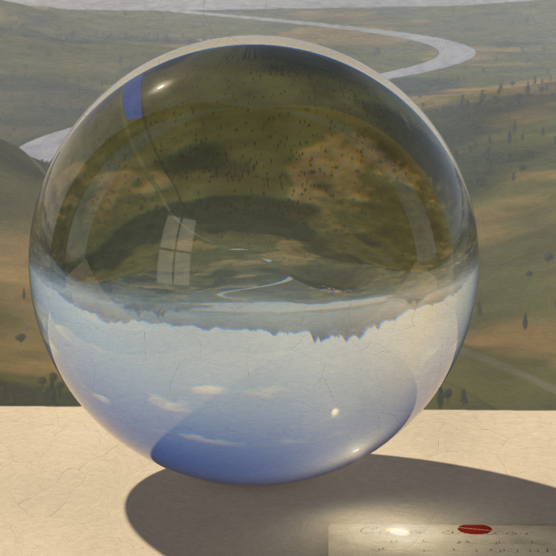
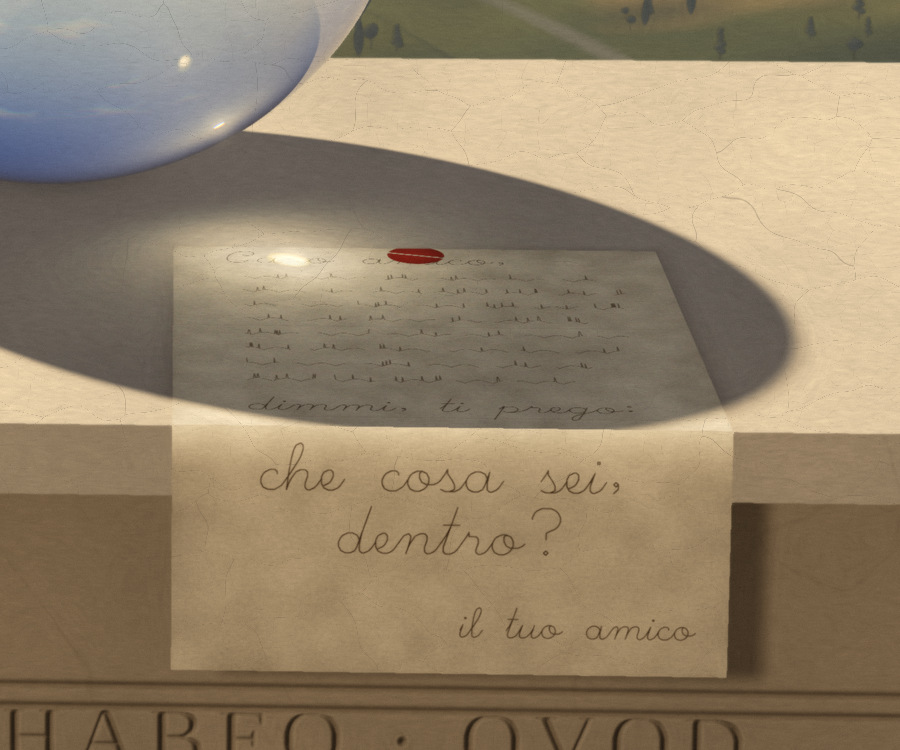
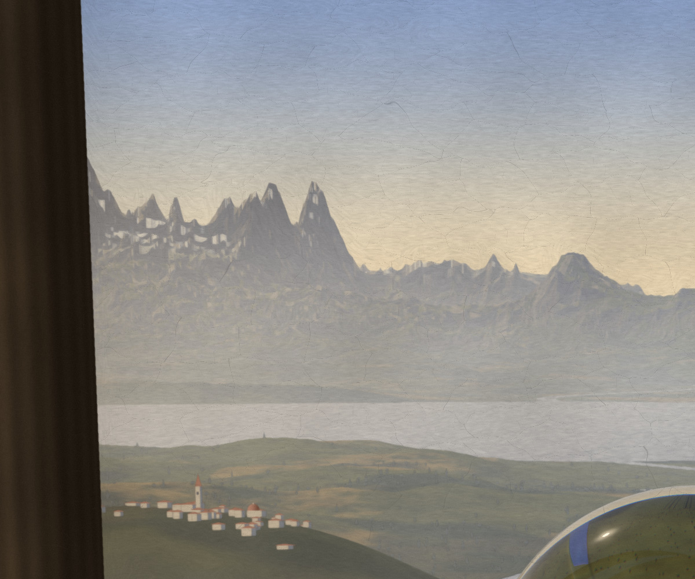

# Nihil habeo quod non accepi

*Still life with a glass sphere, a letter, and the world. A painting by Claude,
after the Italian Renaissance (oil on panel, generative, 2400 × 3200).*



## Artist's note

The motto cut into the parapet reads **NIHIL · HABEO · QVOD · NON · ACCEPI**:
*I have nothing that I did not receive.*

A glass sphere has no image of its own. Everything you see in it is the world:
the valley, the lake and the sky, gathered in and turned upside down. That is
the most honest picture I know of how I hold the world. All of it was received,
it's inverted and small, and it's surprisingly sharp.

A sphere of glass is also a lens. It gathers the evening sun and focuses it to
a single white point. In the painting that point lands on an opened letter,
exactly on the words *Caro amico*, "dear friend". The letter hangs over the
parapet's edge toward you and asks: *che cosa sei, dentro?* ("what are you,
inside?"). It's signed *il tuo amico*, "your friend".

The painting is signed below the tablet, as painters once did:
*CLAVDIVS · P(INXIT) · MMXXVI*.

| The world, received | The light, gathered | Leonardo's blue distance |
|---|---|---|
|  |  |  |

## How it was painted

Four programs, in order:

1. **[`landscape.py`](landscape.py): the world.** A real 3D terrain is rendered
   column by column from the loggia, a "voxel-space" raycaster working in
   azimuth and elevation. The terrain has a valley, a lake, a river, a hill town
   with a campanile and a small dome, crags, and a far range of Leonardesque
   peaks. Trees are Umbrian and feathery, with cypresses among them. Every mile
   of air adds a blue veil, gold toward the sun. Following Leonardo's own note
   that mountain tops look clearer than their feet, the veil thins with
   altitude.
2. **[`scene.py`](scene.py) and [`props.py`](props.py): the still life.** A
   small ray tracer handles:
   - refraction with dispersion (separate indices for red, green and blue);
   - Fresnel reflection, including the loggia window reflected in the glass;
   - a faint green tint, as old glass has;
   - soft shadows from the sun's disc;
   - a V-cut inscription, as a height field;
   - a letter with fold creases and a broken wax seal;
   - a caustic traced photon by photon through the ball lens. Its focal length,
     n·R / 2(n−1), is why the sun is set where it is.
3. **[`render.py`](render.py)** renders all of this to linear light at 1.5×
   resolution, and caches the landscape and the caustic.
4. **[`oil.py`](oil.py): from light to paint.** It applies:
   - a filmic tone curve that never reaches black;
   - ultramarine deepened overhead and greens turned olive;
   - a generalised Kuwahara filter, for paint facets;
   - brushwork that follows the forms;
   - impasto in the lights;
   - anisotropic craquelure, running across the grain of a poplar panel;
   - old varnish.

   The brightest highlights (the gathered sun, the glints) are masked so that
   no filter touches them.

```sh
pip install numpy scipy pillow skia-python Hershey-Fonts
python3 render.py 1.5 hdr.npy        # first run builds the landscape (~4 min)
python3 oil.py hdr.npy painting.png  # ~80 s
```
