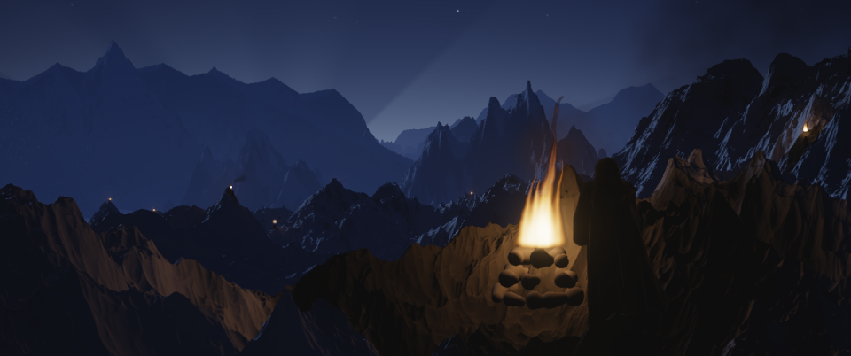

# Terrain-ceiling audit

**All 26 sampled target frames/views match exactly at 700 m and 3000 m in source depth, float RGB and quantized RGB.** This covers the 16 explicitly requested A2/A11/A18/A13 frames and 10 additional representative bluehour, beacon and probe samples. The table below reports each sample and its action; these measurements support no additional caller ceiling patch.

The separate **A15 frame 4360 positive control detects the known 700 m failure**: 3000 m recovers 2,272 source pixels from sky to terrain, changing 1,243 output pixels. The maximum channel difference is 34/255 within output box `[545, 93, 750, 134]`. The accepted 2784.5 m ceiling matches 3000 m exactly in depth and RGB at this frame; it also matches at all seven A2/A11 samples. A15 is an additional control, so the report contains 27 rows in total.

Each raw JSON records its source commit and shot-file hash. Output is 960×402, except bh_probe's native 1920×804. The full-frame adapters request supersampling 1.5; A13/beacon retain their world layer's own source-canvas resolution, recorded per pass in JSON. These are reconstructions from the pushed source, not downloaded production frames.

| Shot | Frame | 700 m clips? | Changed source depth pixels | Where in output (inclusive xy box) | Max RGB difference (8-bit) | Action |
|---|---:|---|---:|---|---:|---|
| A2 | 80 | No | 0 | None | 0 | No ceiling-driven change indicated at this sampling |
| A2 | 300 | No | 0 | None | 0 | No ceiling-driven change indicated at this sampling |
| A2 | 380 | No | 0 | None | 0 | No ceiling-driven change indicated at this sampling |
| A2 | 500 | No | 0 | None | 0 | No ceiling-driven change indicated at this sampling |
| A2 | 559 | No | 0 | None | 0 | No ceiling-driven change indicated at this sampling |
| A11 | 3120 | No | 0 | None | 0 | No ceiling-driven change indicated at this sampling |
| A11 | 3359 | No | 0 | None | 0 | No ceiling-driven change indicated at this sampling |
| A18 | 4880 | No | 0 | None | 0 | No ceiling-driven change indicated at this sampling |
| A18 | 5100 | No | 0 | None | 0 | No ceiling-driven change indicated at this sampling |
| A18 | 5300 | No | 0 | None | 0 | No ceiling-driven change indicated at this sampling |
| A18 | 5480 | No | 0 | None | 0 | No ceiling-driven change indicated at this sampling |
| A18 | 5700 | No | 0 | None | 0 | No ceiling-driven change indicated at this sampling |
| A18 | 5839 | No | 0 | None | 0 | No ceiling-driven change indicated at this sampling |
| A13 | 3680 | No | 0 | None | 0 | Report only; production file has unpublished edits |
| A13 | 3740 | No | 0 | None | 0 | Report only; production file has unpublished edits |
| A13 | 3799 | No | 0 | None | 0 | Report only; production file has unpublished edits |
| bluehour | 5840 | No | 0 | None | 0 | No ceiling-driven change indicated at this sampling |
| bluehour | 6080 | No | 0 | None | 0 | No ceiling-driven change indicated at this sampling |
| bluehour | 6239 | No | 0 | None | 0 | No ceiling-driven change indicated at this sampling |
| bluehour | 6479 | No | 0 | None | 0 | No ceiling-driven change indicated at this sampling |
| beacon | 1200 | No | 0 | None | 0 | No ceiling-driven change indicated at this sampling |
| beacon | 1476 | No | 0 | None | 0 | No ceiling-driven change indicated at this sampling |
| beacon | 1480 | No | 0 | None | 0 | No ceiling-driven change indicated at this sampling |
| beacon | 1555 | No | 0 | None | 0 | No ceiling-driven change indicated at this sampling |
| bh_probe | 2 | No | 0 | None | 0 | No ceiling-driven change indicated at this sampling |
| bh_probe | 3 | No | 0 | None | 0 | No ceiling-driven change indicated at this sampling |
| A15 | 4360 | Yes | 2272 | [545, 93, 750, 134] | 34 | Known A15 failure; current fix already adopted |

## A15 control images

The unchanged accepted scene at frame 4360, with its normal finish. At 700 m, the distant blue ridge ends in a vertical edge near the right of the frame. With the accepted 2784.5 m ceiling, the missing ridge is restored. The two PNGs were inspected, and their decoded difference independently reproduces the report's 1,243 changed output pixels, maximum 34/255 and output box. The accepted-ceiling PNG is pixel-identical to the 3000 m diagnostic.

700 m:


Accepted 2784.5 m:



## Method and limits

The harness changes only the actual marcher’s ceiling argument (700 versus 3000 m). It captures every source row and column in every march pass. Keeping all rows preserves the bottom-to-top column history; this extends the previous strip check to the whole source canvas. Camera equality, depth-array shape and pass count are checked between conditions. JSON records retain per-pass counts, finite-depth deltas, source-coordinate boxes and current-ceiling comparisons.

A2/A11 additionally compare the accepted 2784.5 m bound with 3000 m. A15 frame 4360 is the known-failure control, using the accepted scene with its normal finish and no cairn alternatives. The control's recovered source pixels occupy `[828, 146, 1134, 205]` on its 1460×616 source canvas. They were sky at 700 m, so the finite-to-finite depth delta remains zero; that value does not mean the depth buffers matched.

A2/A11 skyline caches reset for each frame and condition; A11’s static terrain cache also resets. This isolates the ceiling but does not replay the farm’s per-chunk skyline cache history. A18’s complete terrain table is initialized before planting figures in either condition. Bluehour captures both its main and valley-subwindow march calls when present.

A2, A11, A18, bluehour and A15 compare finished full frames. **A13 and beacon compare their actual background world layers**, before foreground compositing, with reveal gain 1 and a diagnostic finish. Their pixel maxima are background metrics; they do not include the delivered frame’s later depth of field or shot-specific exposure. A13 source remains untouched. Beacon frame numbers are H1 source frames; other film numbers are cut frames.

The additional bluehour samples cover its start, T14, A19’s last frame and A20’s last frame (the latter shares the renderer). Beacon samples cover close-up, roar, the background-resolution transition at ROAR+4, and the final pull-back. Probe views 2/3 show clouds removed/present. Probe view 1 is a top-down height map without a marcher and is not applicable. Probe depth labels are suppressed so changing text cannot dominate its RGB difference; the probe still performs its own existing 8-bit quantization.

Max RGB difference means the largest absolute channel difference after deterministic `round(255*clip(RGB,0,1))`; JSON also stores the unquantized float maximum. Production PNG dither is deliberately bypassed. Source and output boxes are separate coordinate spaces; bluehour’s second pass has its own cropped camera. March depths are horizontal ray distances in metres. Sky values ≥1e29 are counted as sky, excluded from finite-depth maxima, and reported separately when recovered as terrain.

“No” applies to these frames and resolutions. It does not certify untested frames, final production assets, or other causes of visual defects. Raw reports preserve the metadata available at run time; early A2/A11 runs predate some harness provenance fields.

Final source check: all eight main shot files still match their recorded SHA-256 hashes in fetched `origin/claude/long-dawn-v2` at `77d7113571049a74716b1366b9496b9d7ae89007`. The measurements remain tied to the source commits below; a main-file hash alone does not certify every transitive dependency or subsequent production edit. A13's unpublished production changes were unavailable and were not reconstructed.

## Reproduction

Run one shot per fresh process to isolate legacy module names and caches. Use an absolute output directory; the CLI defaults to two Numba threads, one thread for other math/image libraries, and pauses between conditions at one-minute load ≥8. The run was also manually suspended during a higher-load interval. No farm operations occurred.

```sh
python -B the-long-dawn/edit/tools/terrain_ceiling_audit.py --shot A18 --frames 4880,5100,5300,5480,5700,5839 --out /absolute/audit/A18
python -B -m unittest discover -s the-long-dawn/edit/tools/tests -v
```

Raw results: [A2](A2.json), [A11](A11.json), [A18](A18.json), [A13](A13.json), [bluehour](bluehour.json), [beacon](beacon.json), [bh_probe](bh_probe.json), [A15](A15.json).

Source commits:

- A2: `e096e99942a16e77030bb4a4df184755505f47ee`
- A11: `e096e99942a16e77030bb4a4df184755505f47ee`
- A18: `e096e99942a16e77030bb4a4df184755505f47ee`
- A13: `4768278169e16e0365954f7d29120a639fcd1485`
- bluehour: `4768278169e16e0365954f7d29120a639fcd1485`
- beacon: `3d5913a7d0b0d2d7007eb2ab67c43e69969f9a19`
- bh_probe: `3d5913a7d0b0d2d7007eb2ab67c43e69969f9a19`
- A15: `3d5913a7d0b0d2d7007eb2ab67c43e69969f9a19`
