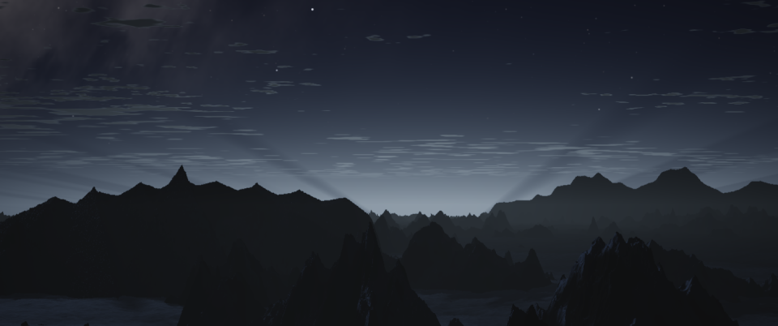
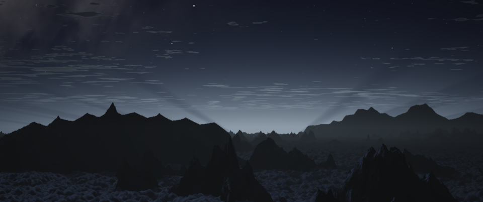
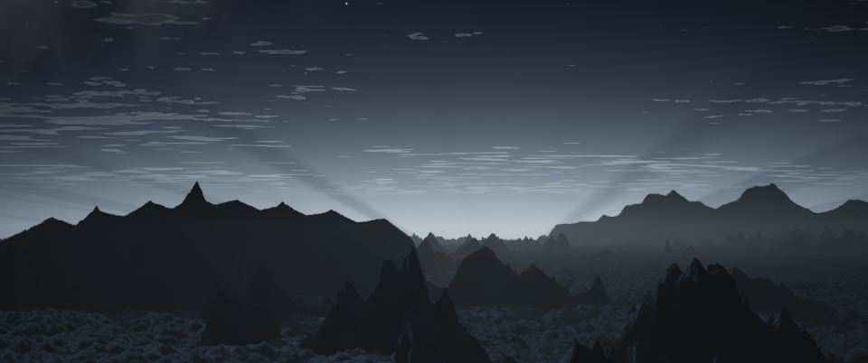
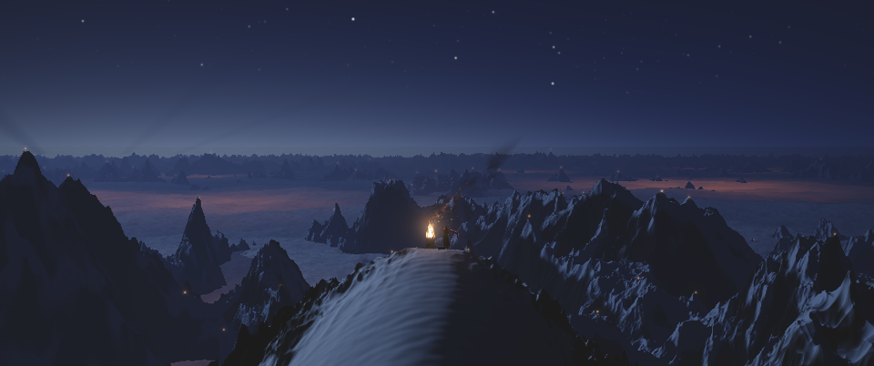
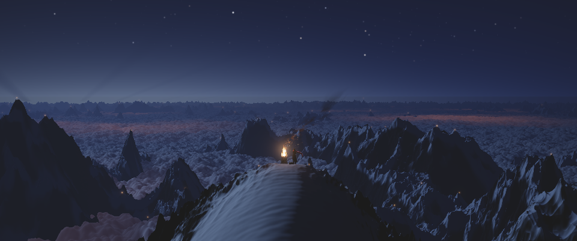
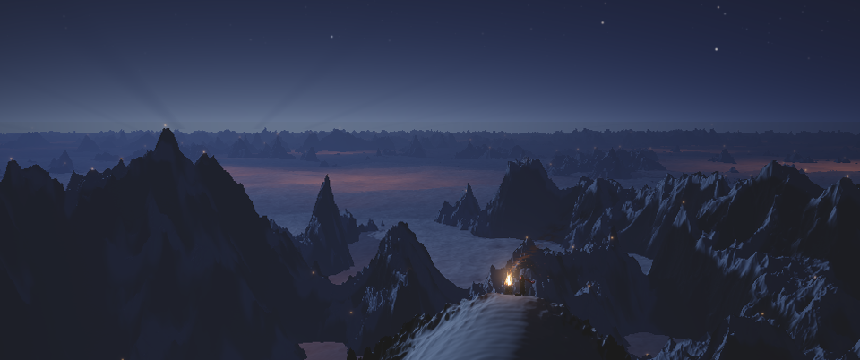
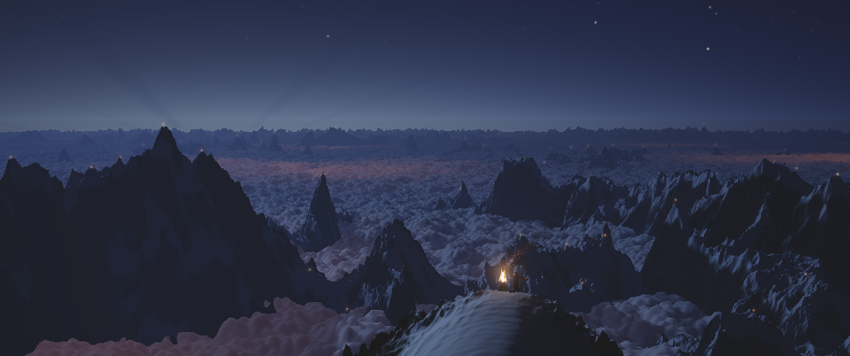

# A cloud-sea relief: director comparison

The candidate adds rounded cloud geometry behind a runtime per-shot opt-in. **Every production shot remains off.** These are the four requested complete 960×402 frames, with each shot's existing camera, lights, atmosphere and finish. A13 includes its foreground and distant-fire table.

The original source and revised source with the flag disabled match exactly at all four frames: complete source-depth buffers, unquantized finished RGB and quantized RGB all have identical hashes. Enabling the flag changes depth and finished RGB in every frame. This establishes an isolated geometry change at the sampled frames; it does not establish acceptance or motion continuity.

My visual reading: A13 gains a legible bank of cloud volume around the mountain bases; the mountain openings and under-cloud warmth remain readable. A2's foreground becomes much busier, with dense, fairly uniform small lobes that can read as foam. I would treat the current 360/125/45 m scale mixture as a comparison candidate. The unresolved artistic question is whether broader masses and less fine relief would better preserve A2's quiet foreground. No such alternative has been tested here, and this candidate has not been enabled in a shot.

## Requested frames

The disabled image is also pixel-identical to its independently rendered original-source control. Click an image for its full size.

| Frame | Original / disabled | Enabled, strength 1 |
|---|---|---|
| A2 380 |  |  |
| A2 500 |  |  |
| A13 3720 |  |  |
| A13 3799 |  |  |

| Frame | Original = disabled, depth and RGB | Enabled changes depth | Changed output pixels | Maximum channel difference, 0–255 |
|---|---|---|---:|---:|
| A2 380 | Exact | Yes | 50,406 | 71 |
| A2 500 | Exact | Yes | 50,228 | 80 |
| A13 3720 | Exact | Yes | 67,043 | 80 |
| A13 3799 | Exact | Yes | 83,365 | 83 |

These differences measure effect size, not image quality. [comparison.json](comparison.json) includes the full metrics and bounding boxes. Those boxes include isolated one-code-value differences in the finished image: for example, A2 500 has 26 changed pixels above row 200, all differing by just 1/255. No lighting or finishing parameter was changed.

## Implementation and checks

The shared A world interprets `P[3]` as a strength clamped to [0,1], with zero or an absent fourth element preserving its previous geometry. The base `h_cloud` function is unchanged. B's separate world renderer therefore retains its existing base cloud implementation. Three bounded, world-anchored cap fields add at most 180 m before the existing cloud holes and Earth curvature. The same flag reaches the marcher, shadow rays, cloud normals, classification and under-glow. The candidate updates the conservative cloud-height calculation; terrain still determines A2's ceiling. No production caller changes its parameter array.

The study's A13 adapter obtains the actual generated hills world and wraps its march/shade/glow entry points. A review caught the ordinary CLI's missing-fire-table check being bypassed by direct rendering; the driver now rejects absent, empty, malformed or nonfinite input before renderer import, loads the validated table, and records its SHA256. Both trees contain the same finite 83×6 float64 table, SHA256 `7b5f135066539a90790008eb328bb0e10d08ecc2805a44851b98ea35e6c0b284`. The published A13 original/off controls were rerendered through this corrected preflight.

Validation: **15 RUN tests pass**, including eight relief tests and the seven existing terrain-ceiling/camera regressions; **12 study-driver tests pass**. The numerical tests exercise actual marcher depth and shadow occlusion off/on/off, bounded heights, cell-boundary continuity, three-element parameter compatibility and the generated hills module. They require positive effects when enabled and exact restoration when disabled. Driver tests cover frame mapping, finishing, all three flag routes, failure restoration, completed-depth hashes, fire-table validation and deterministic PNG encoding. All four before/after pairs were visually inspected.

The A13 original/off/on renders emit the existing `beacon.py:68` NumPy power warning. Every completed frame passed the driver's finite-value check, and the original/off hashes match; that source was not patched.

Resource-control review found that renderer imports reset OpenCV's setting, and this Mac's GCD backend does not enforce its requested two-thread cap. Numba was limited to two threads and the supervisor paused its own process at high load, but earlier OpenCV concurrency was not measured. The driver now forces sequential OpenCV work after imports, with its reported value recorded in the manifest. Replays of enabled A2 500 and A13 3799 under that setting match the prior complete depth, float RGB and quantized RGB exactly: [recheck](opencv-recheck.json), [A2 receipt](A2-sequential-recheck.json), [A13 receipt](A13-sequential-recheck.json). The [OpenCV 5.0 implementation](https://github.com/opencv/opencv/blob/5.0.0/modules/core/src/parallel.cpp#L510-L620) and local probes establish why `setNumThreads(0)` is used.

## Provenance and limits

Manifests preserve source Git revisions, source SHA256 values, parameter arrays seen at the real entry points, complete depth-buffer hashes and finished-frame hashes. Output paths alone are rewritten to relative filenames for portability. The candidate geometry hashes correspond to implementation commit `17e8f9f`; some manifests predate the commit and record its parent alongside the actual modified-source hashes. A2 receipts predate the A13-only preflight addition. Render times include setup/compilation and load pauses and are not performance benchmarks.

- A2: [original](A2-original.json), [disabled](A2-off.json), [enabled](A2-on.json).
- A13: [original](A13-original.json), [disabled](A13-off.json), [enabled](A13-on.json).

This remains a heightfield: it has no overhangs or volumetric interior. The pre-existing fixed-height skyline and mist approximations remain; see the [implementation and reproduction notes](../../edit/tools/cloudsea_study.md). This still study does not test a motion sequence, final 1920×804 delivery, A14, or the H1→A13 continuity join. A13's unpublished production changes were unavailable. The separate `dawn`, `relight` and ink renderers are outside this opt-in study.

Before any enablement, the director needs to choose the cloud scale/strength and examine motion plus the 3679→3680 join against current production sources. The original accepted version remains available with strength zero.
